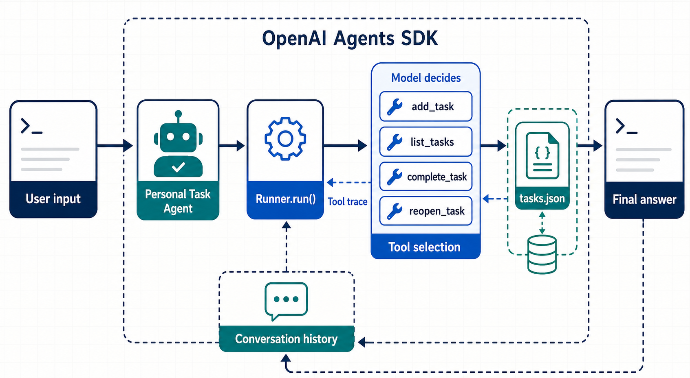

# Build First AI Agent

A small command-line AI agent that manages a persistent task list through
natural-language requests. It uses the OpenAI Agents SDK to decide when to call
local Python tools, keeps conversation context for the current session, and
stores tasks in `tasks.json`.

## Code flow



The CLI sends the user's message and the current session history to
`Runner.run()`. The model can then select one of the four local task tools,
which read or update `tasks.json`. The program prints the tool trace and final
answer, then carries the updated conversation history into the next turn.

## What it can do

- Add one or more tasks.
- List pending, completed, or all tasks.
- Complete a task by ID, exact title, or partial title.
- Reopen a completed task.
- Answer ordinary questions without calling a task tool.
- Print each tool call, its input, and its output for inspection.

The agent exposes four local tools:

| Tool | Purpose |
| --- | --- |
| `add_task` | Add a task with a generated eight-character ID |
| `list_tasks` | List `pending`, `done`, or `all` tasks |
| `complete_task` | Change a matching task's status to `done` |
| `reopen_task` | Change a matching task's status to `pending` |

## Requirements

- Python 3.12.11 or a compatible Python 3.12 installation
- [uv](https://docs.astral.sh/uv/)
- An [OpenAI API key](https://platform.openai.com/api-keys)

## Setup

Install the locked dependencies:

```bash
uv sync
```

Create a `.env` file in the project root:

```dotenv
OPENAI_API_KEY=your_api_key_here
```

The `.env` file is ignored by Git. Do not commit API keys.

## Run

Start the interactive agent from the project root:

```bash
uv run main.py
```

Try prompts such as:

```text
Add "record a YouTube video" to my task list.
Add buy groceries and finish the report.
Show my pending tasks.
Mark the YouTube task as done.
Show all tasks.
Reopen the YouTube task.
```

Type `exit` or `quit` to stop the program.

## How it works

1. The CLI adds each message to the current conversation history.
2. `Runner.run()` sends that history and the agent definition to the model.
3. The model can call one or more registered task tools.
4. Each tool reads or updates the local JSON task store.
5. The CLI prints the tool trace followed by the agent's final response.

Conversation history exists only while the program is running. Tasks persist
between sessions because changes are written to `tasks.json`.

## Task storage

Tasks use this structure:

```json
[
  {
    "id": "efbefd91",
    "title": "record youtube video",
    "status": "done"
  }
]
```

When completing or reopening a task, matching is attempted in this order:

1. Exact task ID
2. Exact title
3. Partial title

If several titles contain the same partial text, the first matching task is
used.

## Project structure

```text
.
├── assets/
│   └── agent-code-flow.png  # Generated code-flow diagram
├── main.py                 # Agent, tools, trace output, and CLI loop
├── tasks.json              # Persistent local task data
├── pyproject.toml          # Project metadata and dependencies
├── uv.lock                 # Locked dependency versions
└── flowchart.excalidraw    # Editable project flowchart
```

## Further reading

- [Using tools with the OpenAI API and Agents SDK](https://developers.openai.com/api/docs/guides/tools)
- [OpenAI Agents SDK for Python](https://openai.github.io/openai-agents-python/)
